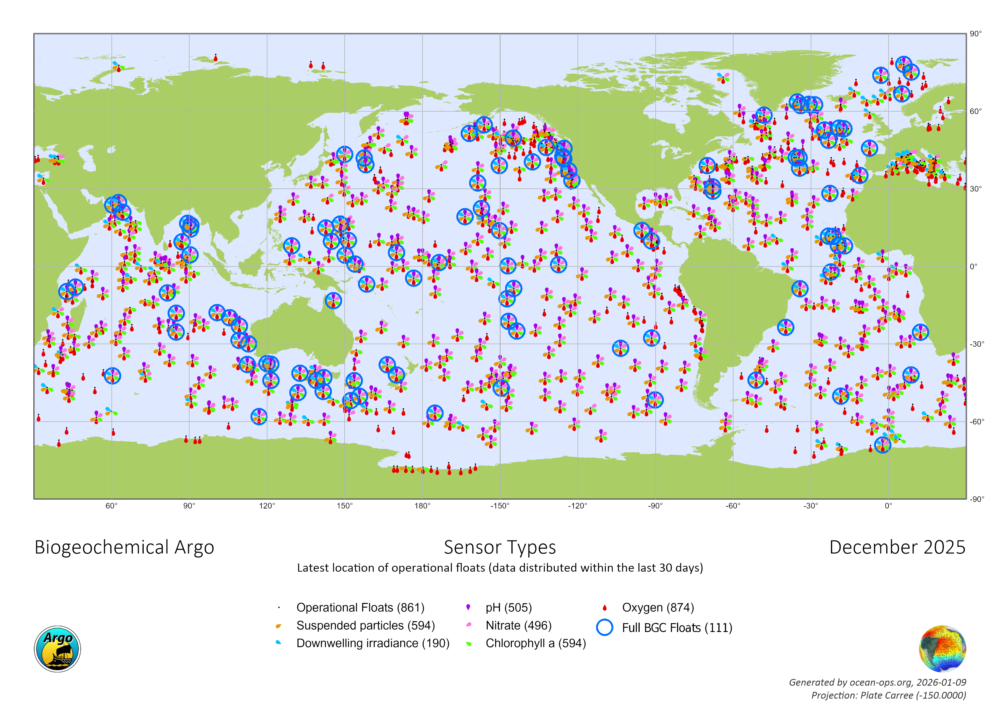

# Summary

`ar-bgc-argo` is a set of Jupyter Notebook templates that transform raw profiles of biogeochemical Argo (BGC-Argo) floats into "analysis-ready" time series of ocean temperature, salinity, and biogeochemical variables. Users can search for floats based the dates, geographic region, and biogeochemical variables of their interests. After downloading the profile time series of a selected float, `ar-bgc-argo` can visualize, filter, interpolate, and save the post-processed time series as a netCDF file. In addition, `ar-bgc-argo` applies variable-specific treatments and derive additional oceanographic variables using empirical equations. `ar-bgc-argo` is designed to help expand the end users of the growing BGC-Argo float data.

# Statement of need

Biogeochemical Argo (BGC-Argo) is a global network of autonomous profiling floats in the ocean that has brought dramatic advances in our understanding of ocean biogeochemistry and marine ecosystems in recent years [@thierry2025]. The global BGC-Argo community aims to cover the global ocean with 1,000 floats that operate every 10 days or so, monitoring biogeochemical properties from the sea surface to 2,000 m deep [@claustre2020]. These profiling floats are equipped with sensors that can measure up to six key variables: chlorophyll-a, pH, oxygen, nitrate, irradiance, and suspended particles [@bittig2019]. As of December 2025, 861 BGC-Argo floats are already in operation, but only 111 of these are equipped with the six full sensors (Figure 1). The collected profiles are made publicly available in the netCDF format within a day or so [@wong2020].

Despite the growing application of BGC-Argo data, the raw profiles include technical errors and doubtful values because of poor sensor calibration and high sensitivity to noise and artifacts. Furthermore, the data are unfiltered (containing both good- and bad-quality samples) and have inconsistent sampling depths among profiles from a given float. These issues necessitate post-processing prior to scientific analysis, which requires technical knowledge hence, becomes a time-consuming task.

# Overview of ar-bgc-argo

`ar-bgc-argo` consists of three Jupyter Notebook templates: `search.ipynb`; `download.ipynb`; and `generate.ipynb`. To use these templates, users create a copy of the template of their interest, modify its inputs, and run it on their Jupyter environment.

## search.ipynb

`search.ipynb` searches for BGC-Argo floats from the synthetic-profile index file (argo_synthetic-profile_index.txt) of the Global Data Assembly Center [GDAC\; @bittig2019] and based on the user inputs, including the temporal and spatial coverages and the biogeochemical variables of interest. In addition, `search.ipynb` allows users to narrow
down the float selection based on three key criteria:

- mindays: the minimum duration of the data record to ensure sufficient temporal coverage (e.g., at least 365 days).

- minfreq: the minimum sampling frequency required to capture temporal variability (e.g., at least every 14 days).

- maxdrift: the float's maximum drift speed (e.g., 0.05 m/s), which is particularly useful for identifying "quasi-Eulerian" floats suitable for one-dimensional modelling [e.g., @bruggeman2024].

The trajectories of all qualified floats based on the search criteria are drawn on a map and their temporal coverages are visualized on a time series. These visualizations provide an intuitive overview, enabling users to identify potential spatial and temporal biases in observational coverage within the study region of interest prior to data retrieval [@hayashida2025].

## download.ipynb

`download.ipynb` retrieves the concatenated synthetic-profiles time series of a selected float (\[wmoid\]\_Sprof.nc, where \[wmoid\] is the seven-digit World Meteorological Organization Identifier or WMO ID). While `download.ipynb` naturally follows the selection made in `search.ipynb`, it can also be used independently if the WMO ID of the
target float is already known. Upon execution, `download.ipynb` creates a directory named after the WMO ID to store the data. It then identifies the correct file path from the synthetic-profile index file and downloads the data from one of the two GDACs.

## generate.ipynb

`generate.ipynb` is the core component of `ar-bgc-argo`, designed to transform raw BGC-Argo profiles into "analysis-ready" time series suitable for immediate scientific application. The data processing workflow consists of eight steps (Figure 2). At every step, diagnostic plots are generated and enable users to visually verify the reliability of the post-processing, which prevents a "black-box" approach and ensures the production of high-quality datasets.

# Software design

`ar-bgc-argo` was designed to help get started with the BGC-Argo data analysis, while allowing the users to see and modify the source code as they run the Jupyter Notebook templates. Doing so motivates the users to learn the code and customize it for their own application. This approach is structurally different from library-based products [e.g., @maze2020], which are designed to work without needing to see the source code. Furthermore, `ar-bgc-argo` gives immediate access to post-processed data as soon as the data become available on GDACs. This near-real-time capability is advantageous over data archiving such as @johnson2023, which is updated approximately every six months.

# Research impact statement

There are various ways in which `ar-bgc-argo` can be used for oceanographic research. First, `ar-bgc-argo` may be used stand alone to monitor and understand the vertical structure of physical and biogeochemical properties in a specific region of interest on a near-real-time basis, which may help in research expedition planning. Second, `ar-bgc-argo` may be adapted to serve as initial and boundary conditions for one-dimensional ocean models as mentioned above [@bruggeman2024]. Third, `ar-bgc-argo` is a quick and easy tool for assessing the performance of large-scale ocean biogeochemical model simulations as it provides refined float time series that has uniform vertical grids ready for immediate comparison. In fact, `ar-bgc-argo` has been used for assessment of seasonal ocean prediction of chlorophyll-a and nitrate in the equatorial Pacific [@doi2026]. Lastly, `ar-bgc-argo` is intended to contribute to attracting new end users of BGC-Argo data globally, but particularly in Japan, by providing the Japanese language support.

# AI usage disclosure

Generative AI tools were used for debugging the Jupyter Notebook templates.

# Acknowledgements

BGC-Argo data are freely available through one of the two GDACs. We thank Hidehiro Fujio for computational assistance and Pete Strutton, Clara Vives, Kanako Sato, Yoshimi Kawai for insightful discussion on BGC-Argo floats and feedback on earlier versions of `ar-bgc-argo`. This work was supported by JSPS KAKENHI Grant Number JP24H02226 and the Nakajima Foundation.

# References

